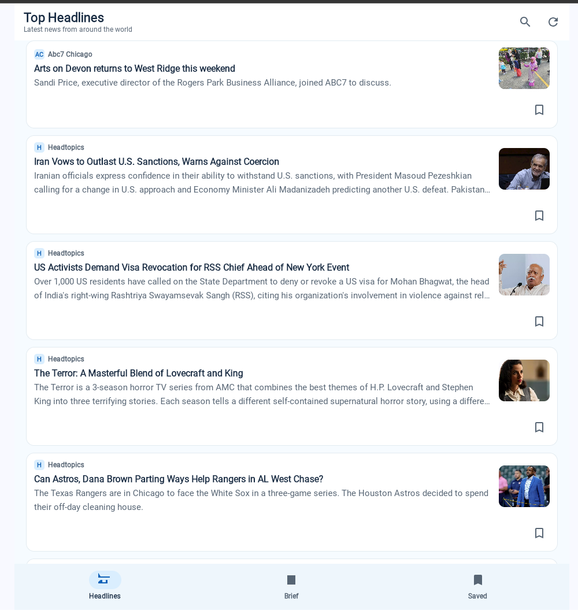
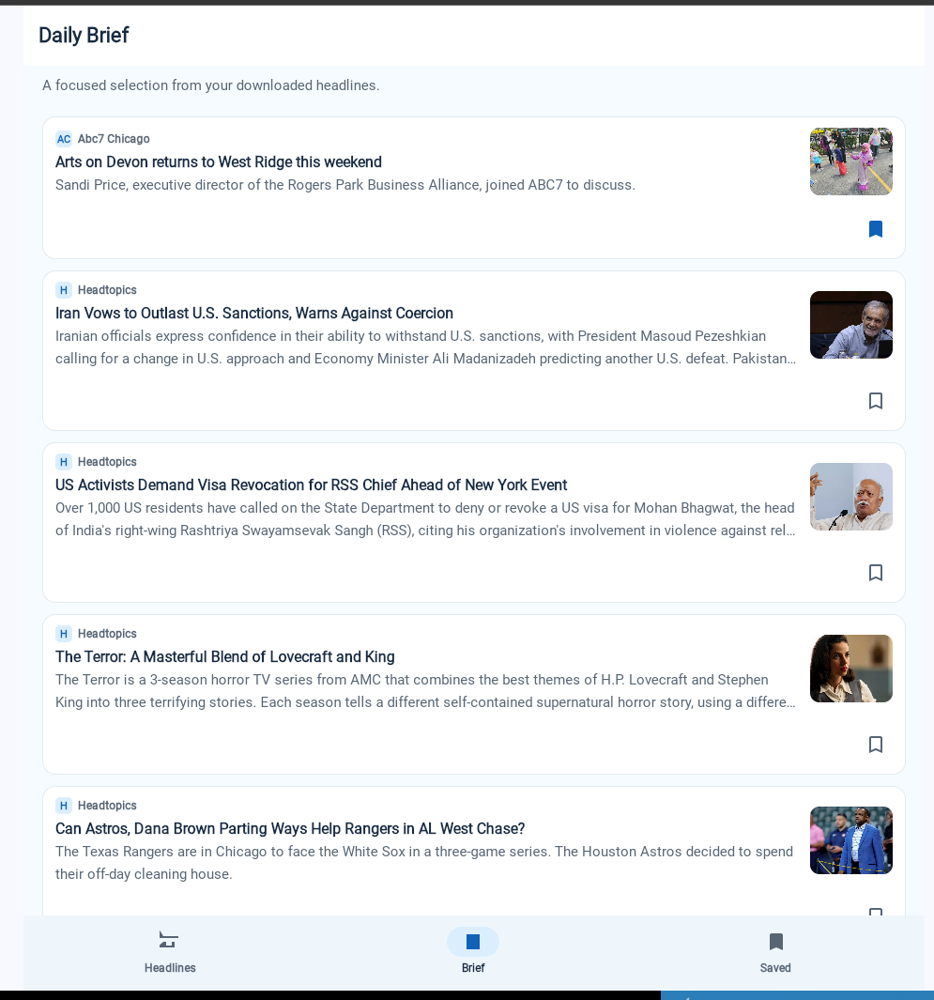
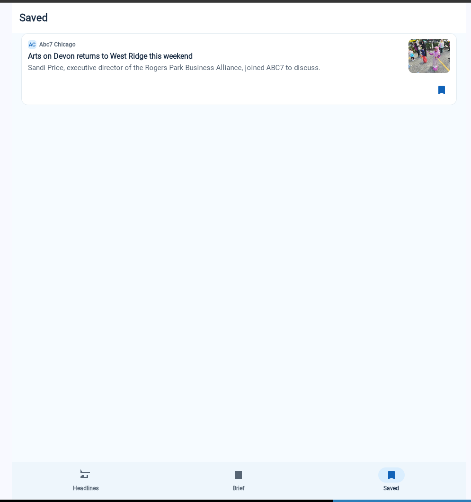
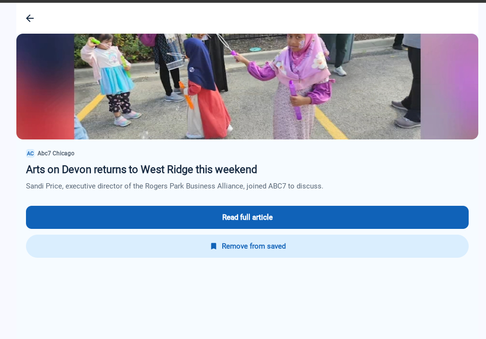
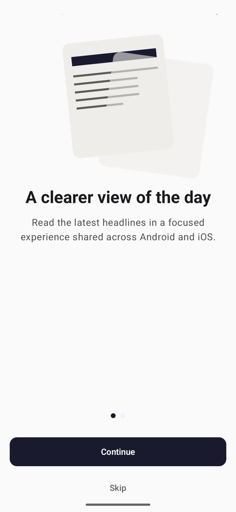
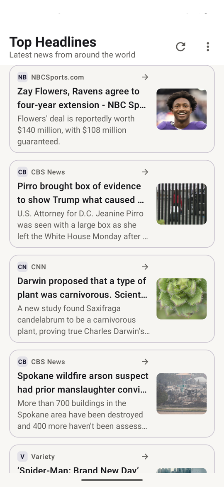
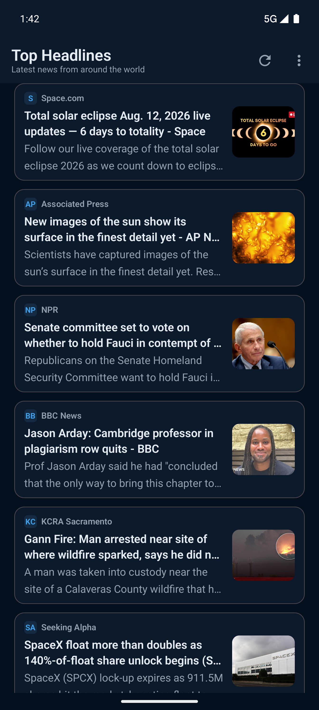
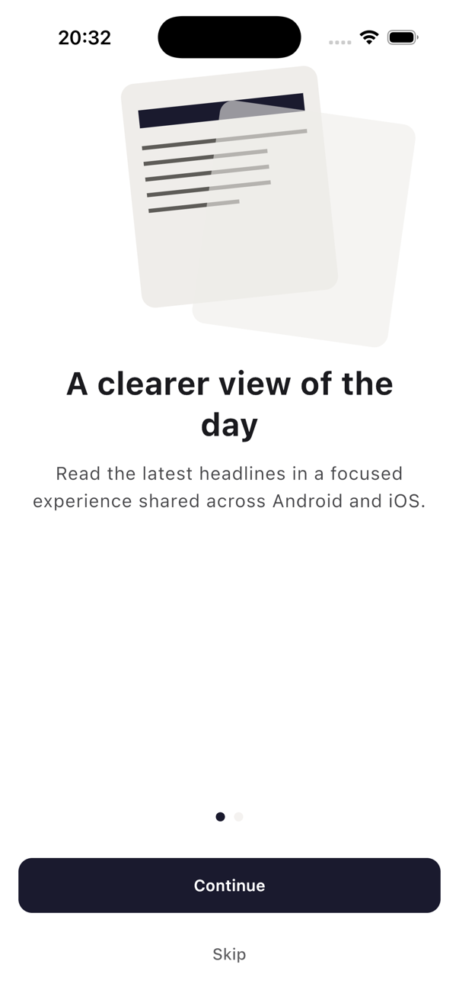
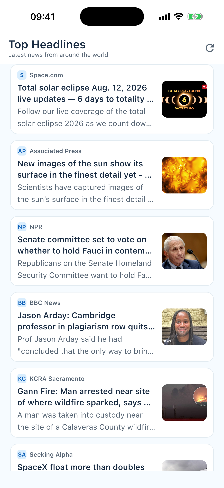
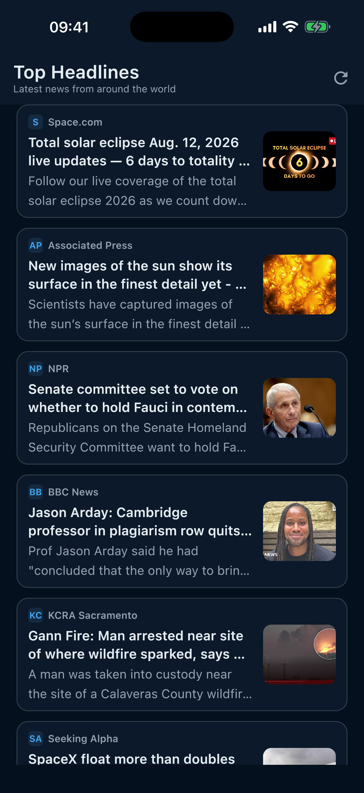

# SignalBrief

SignalBrief is a Kotlin Multiplatform news reader for **Android, iOS, and Web/Wasm**.

The project shares domain contracts, presentation logic, and Compose Multiplatform UI where that reduces duplication, while keeping platform responsibilities explicit:

- **Android and iOS** use the mobile data layer with Ktor, Room KMP, and an offline-first repository. NewsAPI is used directly only for local development.
- **Web/Wasm** uses the same shared domain and presentation/UI contracts, with a browser-specific repository backed by Cloudflare Pages Functions and NewsData.io.
- The public Web deployment keeps provider credentials server-side and proxies article images through a signed, same-origin endpoint.

This repository is an open-source engineering/portfolio project. The Android and iOS apps are **not currently published in the stores**.

## Live Web Demo

**[Open SignalBrief Web Demo](https://signalbrief-bj7.pages.dev/)**

The Web demo serves real headlines and supports the same core reading flow: Headlines, Search, Saved Articles, Article Details, and Daily Brief.

## Engineering case study

[From Android MVVM to Kotlin Multiplatform: Evolving SignalBrief for Android and iOS](https://medium.com/@recipesforsoftware/from-android-mvvm-to-kotlin-multiplatform-evolving-signalbrief-for-android-and-ios-3386b85ebc6c)

A walkthrough of how the original Android application evolved into an offline-first Kotlin Multiplatform project with shared domain, data, presentation, and Compose Multiplatform UI.

[Read the original Android architecture article](https://medium.com/@recipesforsoftware/building-a-modern-android-news-app-with-jetpack-compose-best-practices-without-overengineering-89442c895de9) — this documents the earlier Android-only stage.

## Screenshots

### Web

| Headlines | Daily Brief |
| --- | --- |
|  |  |

| Saved Articles | Article Details |
| --- | --- |
|  |  |

### Android and iOS

| | Onboarding | Top Headlines — light | Top Headlines — dark |
| --- | --- | --- | --- |
| Android |  |  |  |
| iOS |  |  |  |

## Implemented capabilities

- **Android, iOS, and browser/Wasm targets** with shared Kotlin domain contracts and shared Compose Multiplatform presentation/UI.
- **Top Headlines** with loading, success, empty, typed error/retry, refresh, article images, and source metadata.
- **Search** over the locally available headline set.
- **Saved Articles** with bookmark actions and a dedicated Saved destination. Mobile persistence is durable; the Web implementation is intentionally browser-session-only.
- **Article Details** with shared content layout, bookmark state, article image, and safe external article opening.
- **Daily Brief** generated from the currently available headline set.
- **Mobile offline-first cache**: successful remote results are stored in Room KMP and used as an explicit `FeedSource.CACHE` fallback after network failures.
- **Two-page mobile onboarding** persisted with DataStore Preferences on Android and NSUserDefaults on iOS. The Web host intentionally skips onboarding.
- **Light and dark shared themes**, with Android-specific persisted theme selection.
- **Responsive Compose UI** with a capped reading width on large screens.
- **Typed failures** (`NewsFailure.Network`, `InvalidData`, `Unknown`) and cancellation-safe coroutine handling.
- **Public Web backend boundary** using Cloudflare Pages Functions:
  - `/api/headlines` fetches and normalizes NewsData.io content.
  - `/api/image` is a signed image proxy with content-type validation, size limits, and edge caching.
  - provider keys remain server-side and are not embedded in the Wasm bundle.

## Architecture

The current project deliberately does **not** maximize shared-code percentage at all costs. Pure domain behavior lives in `:core`; mobile data/network/storage implementations live in `:shared`; common presentation and UI live in `:shared-ui`; each host owns platform-specific composition.

```text
                          ┌──────────────────────────────┐
                          │ :app — Android host / Hilt   │
                          └──────────────┬───────────────┘
                                         │
                                         ▼
┌──────────────┐                 ┌───────────────────────┐
│    :core     │◄────────────────│      :shared-ui       │
│ pure domain  │                 │ Compose + presenters  │
└──────▲───────┘                 └──────────┬────────────┘
       │                                    │
       │                          ┌──────────┴──────────┐
       │                          │                     │
┌──────┴───────┐          ┌──────▼────────┐    ┌──────▼────────┐
│   :shared    │          │    iosApp     │    │    :webApp    │
│ mobile data  │          │ SwiftUI host  │    │ browser/Wasm  │
└──────┬───────┘          └───────────────┘    └──────┬────────┘
       │                                               │
       ▼                                               ▼
Ktor + Room KMP                              Cloudflare Pages Functions
       │                                      /api/headlines + /api/image
       ▼                                               │
    NewsAPI                                            ▼
                                                NewsData.io
```

See [docs/ARCHITECTURE.md](docs/ARCHITECTURE.md) for module ownership, dependency direction, platform composition, mobile offline-first flow, and the Web request/image-proxy flow.

## Module responsibilities

- **`:core`** — framework-free domain models, repository contracts, typed failures, and web-safe business logic. Targets Android, iOS, and browser Wasm.
- **`:shared`** — mobile data layer. Depends on `:core` and owns Ktor networking, serialization, Room KMP persistence, and `OfflineFirstNewsRepository`.
- **`:shared-ui`** — shared Compose Multiplatform UI and presenters. Its common code depends on `:core`; platform source sets provide image/loading and composition details where needed.
- **`:app`** — Android host and Hilt composition root.
- **`iosApp`** — SwiftUI host. The iOS composition root is assembled explicitly from Kotlin/Swift-facing code.
- **`:webApp`** — browser/Wasm executable, `WebNewsRepository`, and session-only `WebSavedArticlesRepository`. It depends on `:core` and `:shared-ui`, not on the mobile `:shared` data layer.
- **`functions/`** — Cloudflare Pages Functions used only by the public Web path.

## Mobile offline-first data flow

```text
shared UI/presenter
  -> NewsRepository
  -> OfflineFirstNewsRepository
      -> Ktor remote source -> NewsAPI
      -> Room KMP local source

network success
  -> validate/map/deduplicate
  -> replace country cache transactionally
  -> FeedSource.NETWORK

NewsFailure.Network + non-empty cache
  -> return cached feed
  -> FeedSource.CACHE
```

A failed remote request never mutates the cache. `InvalidData` and `Unknown` failures are not hidden by cached content.

## Web data and image flow

```text
SignalBrief Web/Wasm
  -> WebNewsRepository
  -> GET /api/headlines?country=us
  -> Cloudflare Pages Function
  -> NewsData.io

headline image reference
  -> signed /api/image?url=...&sig=...
  -> Cloudflare validates signature, URL, type, and size
  -> upstream image CDN
  -> same-origin response
  -> browser fetch -> ArrayBuffer -> ImageBitmap -> Compose Image
```

This keeps the NewsData key out of JavaScript/Wasm and avoids relying on third-party image CORS behavior.

## Technology stack

| Category | Technology |
|---|---|
| Language | Kotlin, Kotlin Multiplatform, Swift, JavaScript (Pages Functions) |
| UI | Compose Multiplatform, Material 3 |
| Architecture | MVVM-style shared presenters, repository contracts, unidirectional StateFlow |
| Domain | `:core` shared across Android, iOS, and Web/Wasm |
| Mobile DI | Dagger/Hilt on Android; manual composition on iOS |
| Mobile networking | Ktor 3 + kotlinx.serialization |
| Mobile persistence | Room KMP; DataStore Preferences (Android); NSUserDefaults (iOS) |
| Mobile images | Coil 3 |
| Web networking | Browser `fetch` -> Cloudflare Pages Functions -> NewsData.io |
| Web images | Signed same-origin proxy -> `ArrayBuffer` -> `ImageBitmap` |
| Async | Coroutines + Flow |
| Testing | JUnit 4, MockK, Turbine, kotlinx-coroutines-test, Robolectric, kotlin.test, Compose UI test, Espresso |
| Build / CI | Gradle, AGP, Xcode, GitHub Actions, Binaryen |
| Hosting | Cloudflare Pages + Pages Functions |

## Local setup — Android and iOS

NewsAPI is used **only for local mobile development**. No real mobile API key is stored in this repository.

A client-side key embedded in an APK or IPA is extractable, so this setup is intentionally documented as a development configuration rather than a production credential architecture.

### Android key

Create or edit the git-ignored `local.properties` at the repository root:

```properties
NEWS_API_KEY=your_news_api_key
```

### iOS key

Copy the tracked template:

```bash
cp iosApp/Configuration/Secrets.example.xcconfig iosApp/Configuration/Secrets.xcconfig
```

Then set:

```xcconfig
NEWS_API_KEY=your_news_api_key
```

Never commit `local.properties` or `Secrets.xcconfig`.

## Running Android

```bash
./gradlew assembleDebug
./gradlew installDebug
adb shell am start -n pl.recipesforsoftware.signalbrief/.ui.main.MainActivity
```

## Running iOS

```bash
open iosApp/iosApp.xcodeproj
```

or:

```bash
xcodebuild -project iosApp/iosApp.xcodeproj -scheme iosApp -configuration Debug \
  -sdk iphonesimulator -destination 'platform=iOS Simulator,name=iPhone 17 Pro' \
  -derivedDataPath iosApp/build CODE_SIGNING_ALLOWED=NO build
```

## Building Web/Wasm

```bash
./gradlew :webApp:wasmJsBrowserDistribution
```

Production output:

```text
webApp/build/dist/wasmJs/productionExecutable
```

The public Web deployment uses Cloudflare Pages Functions and encrypted production secrets. The repository does not contain the NewsData API key or image-proxy signing key.

## Tests and quality gates

```bash
# Shared/mobile tests and frameworks
./gradlew :shared:allTests :shared-ui:allTests
./gradlew :shared:linkDebugFrameworkIosSimulatorArm64 :shared-ui:linkDebugFrameworkIosSimulatorArm64

# Android
./gradlew test lintDebug ktlintCheck detekt assembleDebug

# Web/Wasm
./gradlew :webApp:wasmJsTest :shared-ui:compileKotlinWasmJs :webApp:wasmJsBrowserDistribution

# Coverage
./gradlew :app:koverHtmlReportAll :app:koverXmlReportAll :app:koverVerifyAll

# Instrumented Android tests — require a device/emulator
./gradlew connectedDebugAndroidTest
```

## CI

Four pull-request checks protect `main`:

- **Android CI** — formatting/static analysis, unit tests, Android lint, debug build, and Kover verification.
- **KMP and iOS CI** — shared tests, framework linking, formatting/static analysis, and an unsigned iOS simulator build.
- **Web CI** — Web/Wasm tests and production browser distribution using the repository's supported Node/Binaryen setup.
- **Dependency Review** — rejects moderate-or-higher vulnerable dependency changes in pull requests.

No production API secret is committed to or required by CI.

## Current limitations

- Android and iOS are not currently published in the app stores.
- Mobile clients still use a developer-supplied NewsAPI key directly for local development; this is not a production mobile secret architecture.
- Web Saved Articles are intentionally **session-only** and reset when the browser application reloads.
- Saved state is not synchronized between platforms or devices.
- The public Web feed currently targets an English/US top-headlines configuration.
- Search operates on the headline set already available to the application; there is no separate server-side search index.
- Payments, account synchronization, analytics, and production mobile signing/release infrastructure are outside this public repository.

## Roadmap

The phased history and planned follow-up work are documented in [IMPLEMENTATION_ROADMAP.md](IMPLEMENTATION_ROADMAP.md). Commercial capabilities such as payments, account synchronization, analytics, and production signing remain intentionally separated from the public portfolio scope.
