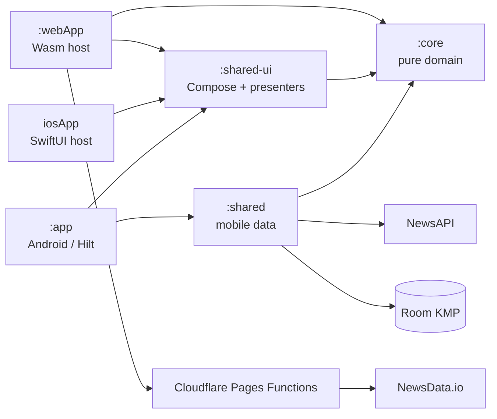

# SignalBrief — Architecture

This document describes the architecture that exists in the repository today. SignalBrief is a Kotlin Multiplatform news reader with Android, iOS, and browser/Wasm hosts. It shares framework-free domain contracts and common presentation/UI while keeping mobile persistence/networking and browser backend responsibilities explicit.

## Design principle

The project does **not** optimize for the highest possible shared-code percentage.

Code is shared when duplication would create maintenance risk or inconsistent behavior. Platform-specific responsibilities stay explicit when the runtime, security model, lifecycle, persistence, or deployment boundary is materially different.

That gives SignalBrief three useful layers:

1. **`:core`** — web-safe, framework-free domain contracts and models.
2. **`:shared-ui`** — shared presenters and Compose Multiplatform UI.
3. Platform/data implementations:
   - **`:shared` + `:app` / `iosApp`** for the mobile offline-first path.
   - **`:webApp` + Cloudflare Pages Functions** for the public browser path.

## Module overview

```text
Unit / module       Targets / runtime                   Responsibility
------------------  ----------------------------------  -----------------------------------------------
:core               Android, iOS, Wasm                  Pure domain models, repository contracts,
                                                        typed failures, web-safe behavior.

:shared             Android, iOS                        Mobile data implementations: Ktor networking,
                                                        kotlinx.serialization, Room KMP cache,
                                                        offline-first repositories.

:shared-ui          Android, iOS, Wasm                  Compose Multiplatform UI, presenters,
                                                        navigation/screen shell, design system.

:app                Android application                 Android host, Hilt composition root,
                                                        Android persistence/theme integration.

iosApp              SwiftUI/Xcode                       iOS host. Embeds the shared UI framework;
                                                        mobile composition is assembled explicitly.

:webApp             Browser/Wasm                        Browser executable, WebNewsRepository,
                                                        browser-local WebSavedArticlesRepository,
                                                        browser-local WebCollectionsRepository,
                                                        browser-local WebTopicMonitoringRepository.

functions/           Cloudflare Pages Functions         Public Web backend boundary:
                                                        /api/headlines and /api/image.
```

## Dependency direction



`:webApp` intentionally does **not** depend on the mobile `:shared` data/network layer.

The iOS-specific composition source set in `:shared-ui` may depend on `:shared` to preserve the current single-framework Xcode integration. Common UI/presentation code still depends on `:core`, not on mobile data implementations.

## `:core`

`:core` contains the portable domain boundary:

- `Article`, `Source`, `TopHeadlinesFeed`, `FeedSource`, `Collection`, and `MonitoredTopic`.
- `NewsRepository`, `SavedArticlesRepository`, `CollectionsRepository`, and `TopicMonitoringRepository` contracts.
- `NewsFailure`, `CollectionFailure`, and `TopicMonitoringFailure` typed failures.
- Business logic that does not require Room, Ktor, Compose, Coil, UIKit, Android, or browser APIs.

This module is the architectural seam that allows both the mobile repository and the browser repository to satisfy the same UI-facing contracts.

## `:shared` — mobile data layer

`:shared` depends on `:core` and contains the mobile data implementation.

### Remote

- Ktor 3 client.
- kotlinx.serialization DTOs and mapping.
- Android and Darwin engines.
- response validation and timeout configuration.
- NewsAPI request configuration.

### Local

- Room KMP database.
- country-scoped cached headline entities/DAO.
- transactional feed replacement.
- persistent mobile Saved Articles storage.
- Room-backed collections and collection memberships.
- Room-backed monitored topics.

### Repository

`OfflineFirstNewsRepository` implements `NewsRepository` with an explicit network-first/cache-fallback policy.

```text
request
  -> remote NewsAPI

success
  -> validate/map/deduplicate
  -> transactionally replace country cache
  -> FeedSource.NETWORK

NewsFailure.Network
  -> read Room cache
  -> if non-empty: FeedSource.CACHE
  -> otherwise preserve original network failure

InvalidData / Unknown
  -> do not hide with cached content
```

Cancellation is rethrown rather than converted into a domain failure.

`OfflineFirstNewsRepository.clearCachedTopHeadlines(country)` deletes only the requested country's cached headlines in one transaction, performs no network request, and leaves observable cache state emitting an empty list afterward.

## `:shared-ui` — presentation and Compose UI

`:shared-ui` contains the application presentation surface shared across targets:

- app shell and main destinations;
- Top Headlines presenter/screen;
- Search presenter/screen;
- Saved Articles;
- Article Details;
- Daily Brief;
- Collections;
- Topic Monitoring;
- Settings and Offline Management;
- mobile onboarding;
- theme and design tokens;
- article cards and shared actions;
- platform image-loading boundary.

Presenters depend on repository contracts from `:core`, not on concrete data implementations.

The UI uses `StateFlow` and explicit callbacks. Repository state is observed by multiple features so Headlines, Search, Saved, Details, Daily Brief, Collections, Topic Monitoring, and Settings stay consistent without each screen owning a separate network implementation.

`SettingsPresenter` observes `NewsRepository.observeCachedTopHeadlines()` reactively to derive the downloaded-headline count and calls `clearCachedTopHeadlines(country)` for explicit local-only cache clearing, which never triggers a network request.

## Android composition

Android uses Dagger/Hilt at the host boundary.

```text
BuildConfig.NEWS_API_KEY
        ↓
NewsApiConfig
        ↓
Ktor Android HttpClient

Room database
        ↓
mobile local data sources

remote + local
        ↓
OfflineFirstNewsRepository
        ↓
shared presenters / UI
```

Android additionally owns DataStore-backed theme/onboarding preferences and Android-specific host behavior.

## iOS composition

The iOS host is SwiftUI embedding the shared Compose framework.

The Kotlin iOS composition root creates the Darwin Ktor client, Room database, repositories, and presenters explicitly. The NewsAPI key is injected through the git-ignored Xcode configuration and read from the app bundle.

This keeps the dependency graph equivalent to Android while avoiding a DI framework in the iOS host.

## Browser/Wasm composition

`webApp` is a browser executable and depends on `:core` and `:shared-ui`.

```text
ComposeViewport
  -> WebNewsRepository
  -> WebSavedArticlesRepository
  -> WebCollectionsRepository
  -> WebTopicMonitoringRepository
  -> SignalBriefAppHost
```

The Web host skips mobile onboarding.

### `WebNewsRepository`

`WebNewsRepository` satisfies the same `NewsRepository` contract as the mobile offline-first implementation.

It:

- requests `/api/headlines?country=...` with browser `fetch`;
- maps the normalized Pages Function response into domain `Article` objects;
- keeps a single current in-memory headline set in a `MutableStateFlow` (no independent per-country Web caches);
- exposes that flow through `observeCachedTopHeadlines(country)` so Search, Daily Brief, and Settings see the same article set;
- clears the current in-memory set locally through `clearCachedTopHeadlines(country)` without performing a network request;
- maps transport/data failures into the shared `NewsFailure` hierarchy.

The browser client does not contain the NewsData API key.

### `WebSavedArticlesRepository`

Web Saved Articles persist in the browser through the `signalbrief.savedArticles.v1` localStorage key. State is loaded once at construction and updated after every successful write, so Saved Articles survive Web application reloads within the same browser.

This is intentionally parallel to the persistent mobile implementation.

### `WebCollectionsRepository`

`WebCollectionsRepository` persists collections and their article memberships in browser localStorage under the `signalbrief.collections.v1` and `signalbrief.collection-memberships.v1` keys.

Collections and memberships are restored at construction and observable state only changes after a successful storage write. Membership snapshots are independent of saved articles, so an article stays displayable in a collection after it is unsaved.

### `WebTopicMonitoringRepository`

`WebTopicMonitoringRepository` persists monitored topic queries in browser localStorage under the `signalbrief.topic-monitors.v1` key.

The queries are restored at construction; observable state only changes after a successful storage write. Matching against local headlines is done by shared presentation logic, so the Web topic-monitoring flow uses the same repository contract and matching semantics as the mobile flow.

## Cloudflare Pages Functions

The public Web deployment has two server-side endpoints.

### `/api/headlines`

```text
browser
  -> /api/headlines?country=us
  -> Cloudflare Pages Function
  -> NewsData.io
```

Responsibilities:

- keep `NEWSDATA_API_KEY` server-side;
- request the English top-headlines feed;
- normalize provider fields into the small payload required by SignalBrief;
- normalize source names;
- generate signed image-proxy references;
- edge-cache responses to reduce upstream requests.

### `/api/image`

Article images come from many unrelated publisher/CDN origins. Fetching them directly from browser Wasm would make rendering depend on every publisher's CORS policy.

The image endpoint therefore provides a same-origin boundary:

```text
normalized headline image URL
  -> HMAC-signed /api/image reference
  -> validate signature
  -> accept HTTPS only
  -> reject obvious local/private targets
  -> fetch publisher/CDN image
  -> validate image content type and size
  -> cache at the edge
  -> return same-origin bytes to the browser
```

`IMAGE_PROXY_SIGNING_KEY` is a Cloudflare secret and is not stored in the repository.

The browser converts the response from `ArrayBuffer` to `ByteArray`, decodes it to `ImageBitmap`, and renders it through the shared article-image component.

## Image-loading boundary

The shared UI does not force one image stack onto every runtime.

- **Android/iOS**: Coil 3 with the mobile network setup.
- **Web/Wasm**: signed same-origin proxy + browser `fetch` + `ImageBitmap`.

`Article Details` and list cards reuse the same platform image boundary, avoiding a separate Web-only Details implementation.

## External article opening

`Article.url` is validated before it is opened. Only `http://` and `https://` destinations are actionable.

The shared UI delegates valid URLs to the platform URI handler:

- Android host / Chrome Custom Tabs where applicable.
- iOS / browser through the platform URI handler.

## Secret handling

### Mobile local development

Android:

```text
local.properties
NEWS_API_KEY=...
```

iOS:

```text
iosApp/Configuration/Secrets.xcconfig
NEWS_API_KEY=...
```

Both files are ignored and must never be committed.

These keys are still client-side at runtime and are therefore explicitly a local-development configuration, not a production mobile credential design.

### Public Web

Cloudflare production secrets:

- `NEWSDATA_API_KEY`
- `IMAGE_PROXY_SIGNING_KEY`

Neither value is embedded in JavaScript/Wasm or committed to Git.

## Test boundaries

### `:core`

Pure repository-contract/model/failure tests.

### `:shared`

- Ktor remote/data mapping tests.
- Room-backed local tests.
- offline-first repository policy tests.
- cancellation and failure classification.

### `:shared-ui`

- presenter tests for Headlines, Search, Saved, Details, Daily Brief, Collections, Topic Monitoring, and Settings;
- shared UI/component behavior;
- Android/iOS/Wasm compilation of the shared UI boundary.

### `:webApp`

- `WebNewsRepository` behavior through an injected loader;
- localStorage-backed Saved, Collections, and Topic Monitoring repository behavior (including mutation and failure paths);
- Wasm tests and production browser distribution.

## CI

Four pull-request checks protect `main`.

### Android CI

- Gradle wrapper validation
- `ktlintCheck`
- `detekt`
- JVM tests
- Android lint
- debug assembly
- Kover verification

### KMP and iOS CI

- shared tests
- iOS framework linking
- formatting/static analysis
- unsigned iOS simulator host build

### Web CI

- supported JDK/Node environment
- Binaryen toolchain
- Wasm tests/build validation
- production browser distribution

### Dependency Review

Fails pull requests introducing moderate-or-higher vulnerable dependencies.

The Web dependency lock deliberately remains free of the Ktor/Coil network dependencies that previously pulled `ws` into the Wasm dependency graph.

## Trade-offs and current limitations

- Mobile networking/storage and browser networking are separate implementations behind shared contracts.
- The Web host persists Saved Articles, Collections, and Monitored Topics in browser localStorage, but there is no cross-device synchronization.
- Search operates over locally available headlines rather than a dedicated backend index.
- The public Web feed currently uses an English/US top-headlines configuration.
- Android and iOS use a developer-supplied NewsAPI key for local development and are not store-published from this repository.
- No account system, cloud Saved synchronization, payments, or analytics backend is included in the public portfolio scope.
- The Web Wasm bundle is larger than a conventional DOM application because it includes the Compose/Skia runtime; current CI reports this as a performance warning rather than a build failure.

## Why this architecture

SignalBrief started as an Android application and evolved into a KMP project. The current structure demonstrates that evolution without pretending every runtime has identical constraints.

The reusable part is the stable product behavior:

- domain models/contracts;
- presenter behavior;
- navigation/screen flow;
- design system and Compose UI.

The replaceable part is infrastructure:

- Android/iOS mobile networking and persistence;
- browser fetch/backend boundary;
- platform image loading;
- host lifecycle and dependency composition.

That separation is the central architectural goal of the project.
