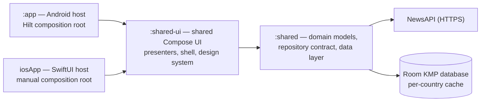
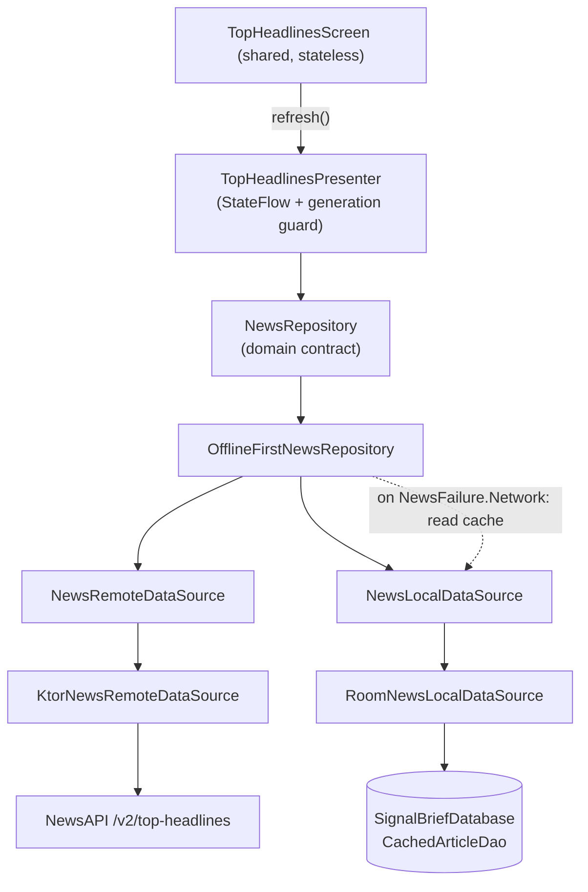

# SignalBrief — Architecture

This document describes the actual architecture of the SignalBrief repository as
of the release-readiness baseline: what each module owns, how the platforms are
composed, how a request flows through the offline-first chain, and the trade-offs
that were made. It describes the code that exists — it is not a generic Clean
Architecture template.

## Module overview

```text
Gradle module        | Kotlin targets               | Responsibility
---------------------|------------------------------|----------------------------------------------
:app                 | Android application          | Hilt composition root, MainActivity, Android
                     |                              | theme/persistence hosts, Android tests
:shared              | android, iosArm64,           | Domain contracts and models, typed failures,
                     | iosSimulatorArm64, iosX64    | Ktor networking, Room KMP cache, offline-first
                     |                              | repository. Framework-free (no UI, no DI).
:shared-ui           | android, iosArm64,           | Compose Multiplatform UI: SignalBriefApp shell,
                     | iosSimulatorArm64            | onboarding, stateless TopHeadlinesScreen,
                     |                              | StateFlow presenter, design tokens, theme.
iosApp               | Xcode project (SwiftUI)      | iOS host embedding SignalBriefSharedUi.framework;
                     |                              | manual composition root in MainViewController.kt.
```

### `:shared`

- `domain/` — `NewsRepository` contract, `Article`/`Source`/`TopHeadlinesFeed`/
  `FeedSource` models, and the sealed `NewsFailure` hierarchy. This code has no
  Ktor, serialization, Room, Android, UIKit, DI, or Compose imports.
- `data/remote/` — `NewsRemoteDataSource` interface; `KtorNewsRemoteDataSource`
  (the only class touching Ktor and kotlinx.serialization), which maps DTOs to
  domain models and translates transport exceptions into typed `NewsFailure`
  values. `HttpClientFactory` is an `expect`/`actual` seam: the Android engine is
  provided in `androidMain`, the Darwin engine in `iosMain`, and `MockEngine` in
  common tests; all shared client configuration (content negotiation, timeouts,
  response validation, base URL, `X-Api-Key` header) is applied through the same
  internal config function.
- `data/local/` — `NewsLocalDataSource` interface; `RoomNewsLocalDataSource`
  backed by `SignalBriefDatabase` (`CachedArticleDao` + `CachedArticleEntity`).
  Operations are country/feed-scoped, ordering is preserved via
  `position_in_feed`, and `replaceAll` swaps a country's cache transactionally.
- `data/repository/OfflineFirstNewsRepository.kt` — the `NewsRepository`
  implementation with the network-first + cache-fallback policy.

### `:shared-ui`

- `app/SignalBriefApp.kt` — shared shell that decides between onboarding, the
  main screen, and a brief loading gate while the persisted onboarding flag is
  read. Installs the shared Coil image-loader once.
- `onboarding/` — `OnboardingPresenter` (StateFlow), `OnboardingScreen`, page
  visuals/strings, a `rememberSaveable` `Saver`, and an `OnboardingCompletion`
  guard that makes the host callback fire at most once per shell instance.
- `topheadlines/` — `TopHeadlinesPresenter` (framework-independent state holder),
  the sealed `TopHeadlinesUiState`, `TopHeadlinesScreen` (stateless), shared
  strings, error mapping, `ArticleUrlValidator`, the Coil-backed `ArticleCard`,
  cache banner, and skeleton cards.
- `designsystem/` — color, typography, shape, and spacing tokens; the shared
  `SignalBriefPrimaryButton` and `OnboardingPageIndicator`; and the `Sigby` mascot
  composable with its production artwork in `commonMain/composeResources`.
- `iosMain/.../MainViewController.kt` — the iOS composition root (see below).

### `:app`

- `SignalBriefApplication` (`@HiltAndroidApp`).
- `di/` — `NetworkModule` (config + `HttpClient`), `DatabaseModule` (database +
  local data source), `RepositoryModule` (remote data source + repository
  binding).
- `ui/main/MainActivity.kt` — host that provides theme, onboarding persistence,
  and the Top Headlines screen (including the dark-mode menu via the
  `topBarActions` slot).
- `ui/theme`, `ui/onboarding`, `ui/topheadlines` — Android-specific persistence
  (DataStore `ThemePreference`/`OnboardingPreference`), Hilt ViewModels, and the
  `DarkModeMenu`.

### `iosApp`

- SwiftUI host (`iosApp.swift`, `ContentView.swift`) embedding
  `MainViewControllerKt.mainViewController()` from
  `SignalBriefSharedUi.framework`.
- Xcode build phase `embedAndSignAppleFrameworkForXcode` compiles the KMP
  framework as part of the app build.
- `Info.plist` receives `NEWS_API_KEY = $(NEWS_API_KEY)` from the git-ignored
  `Secrets.xcconfig`.

## Dependency direction

All dependencies point inward: hosts and UI depend on the domain contract, and
data implementations are plugged in behind it. Domain code never depends on a
framework.



The Android host also depends directly on `:shared` (Hilt needs the Ktor
`HttpClient` and Room types at its composition boundary). `commonMain` in
`:shared` has no Android, UIKit, or DI-framework dependencies; Room types are
kept inside `:shared`'s data layer and only surface at the Android composition
boundary.

## Composition

### Android — Dagger/Hilt

The Android graph is built once by Hilt (`SingletonComponent`):

```text
NetworkModule  -> NewsApiConfig(BuildConfig.NEWS_API_KEY) -> HttpClient (Android engine)
DatabaseModule -> SignalBriefDatabase (singleton) -> NewsLocalDataSource
RepositoryModule -> NewsRemoteDataSource(KtorNewsRemoteDataSource) + NewsLocalDataSource
                   -> NewsRepository(OfflineFirstNewsRepository)
```

`TopHeadlinesViewModel` (`@HiltViewModel`) receives the `NewsRepository` and
wraps `TopHeadlinesPresenter` on `Dispatchers.Main.immediate`; `OnboardingViewModel`
and `ThemeViewModel` provide DataStore-backed persistence. `MainActivity`
(`@AndroidEntryPoint`) reads all three through `hiltViewModel()` and hands the
shared `SignalBriefApp` shell its state and callbacks.

### iOS — manual composition

`MainViewController.kt` builds the identical graph by hand: it reads the
onboarding flag synchronously from `NSUserDefaults` and the NewsAPI key from the
app bundle, then creates the `HttpClient` (Darwin engine), the Room database, the
data sources, the repository, and the presenter. The `IosTopHeadlinesComposition`
owns the externally acquired `HttpClient` and database and closes all three
together when the view controller disappears, so teardown leaves nothing behind.

Both platforms therefore assemble the same shared constructors; only the
composition root differs (`Hilt` vs. explicit Swift/Kotlin calls).

## Presentation / UI relationship

- `TopHeadlinesPresenter` is framework-independent: it owns its `CoroutineScope`
  (`dispatcher + SupervisorJob`), exposes a read-only
  `StateFlow<TopHeadlinesUiState>`, guards against stale responses with a
  monotonically increasing request-generation counter, and must be disposed by
  the host. It calls the `NewsRepository` contract — never a concrete
  implementation.
- `TopHeadlinesScreen` is a stateless composable. It receives `TopHeadlinesUiState`
  and callbacks (`onRefresh`, `onArticleClick`) and renders Loading (animated
  skeletons), Success (with the `FeedSource`-driven cache banner), Empty, and
  Error-with-retry. A `topBarActions` slot lets the Android host inject its
  dark-mode menu without coupling the shared screen to Android.
- The host owns the presenter's lifecycle: `TopHeadlinesViewModel.onCleared()`
  disposes it on Android; a `DisposableEffect` disposes it on iOS.

## Request and data flow



`getTopHeadlines(country)`:

1. **Network success** — the response is deserialized, mapped, and deduplicated
   by URL (first occurrence wins, original order preserved). The unique list
   replaces that country's cache transactionally, and a `FeedSource.NETWORK` feed
   is returned. An empty remote list clears the country's cache.
2. **`NewsFailure.Network`** — the repository falls back to the country's cache.
   If the cache is non-empty, a `FeedSource.CACHE` feed is returned and the UI
   shows the "Showing saved headlines" banner; if the cache is empty, the
   original network failure is preserved.
3. **`InvalidData` / `Unknown` / other failures** — never hidden by the cache;
   the failure is returned as-is.
4. **Cancellation** — always rethrown by the data sources and the repository;
   it is never converted into a failure and never reads the cache.

The policy is deliberately **not** stale-while-revalidate: the UI keeps showing
the current content until the next explicit refresh, and a refresh never serves
cache while a newer remote response is available. A failed remote request never
mutates the cache.

## Why external article URLs are validated

The DTO→domain mapper guarantees `Article.url` is non-blank, but handing an
arbitrary string to a platform URI handler is still risky: an unexpected scheme
(e.g. `javascript:`, `file:`, a malformed URI) could crash the host app. Both
platforms therefore route article opening through
`Article.hasActionableUrl()`, which restricts the open action to `http://` and
`https://` schemes before delegating to the platform handler (Chrome Custom Tabs
on Android, `LocalUriHandler` on iOS).

## Local secret handling

- Android: `NEWS_API_KEY` is read from the git-ignored `local.properties` into
  `BuildConfig.NEWS_API_KEY` (empty when absent), then injected via Hilt into
  `NewsApiConfig` and sent as the `X-Api-Key` header.
- iOS: `NEWS_API_KEY` is injected into `Info.plist` from the git-ignored
  `Secrets.xcconfig` (tracked template: `Secrets.example.xcconfig` with a
  placeholder) and read by `MainViewController.kt` before the client is built.
- CI uses no real key: the macOS workflow writes an obvious fake value into a
  temporary `Secrets.xcconfig` for the unsigned build; the Android workflow needs
  no key.
- A key embedded in `BuildConfig` or a bundle is extractable from the APK/IPA,
  so this is a **local-development-only** setup, not a production secret
  architecture.

## Key test boundaries

- **Common (`commonTest`, run on JVM and iOS simulator)**: Ktor `MockEngine`
  against the exact production client configuration; Room tests against a real
  (JVM JDBC / iOS SQLite) database; `OfflineFirstNewsRepository` policy tests
  (write-through, replacement, empty-list clearing, deduplication, fallback,
  never-hiding non-network failures, cancellation, country isolation); DTO
  mapper; domain models and failures; presenter tests; formatting helpers; URL
  validator; onboarding presenter/completion/saver tests.
- **Android JVM (`app/src/test`)**: Hilt ViewModels (Top Headlines, Theme,
  Onboarding) with MockK and Robolectric, DataStore preference behavior.
- **Android instrumented (`app/src/androidTest`)**: shared Top Headlines Compose
  screen, dark-mode menu, article-card click wiring, DataStore theme behavior,
  application package verification. Present but not part of CI yet.
- **Kover** aggregates JVM unit-test coverage from `:app`, `:shared`, and
  `:shared-ui` into an `all` variant and enforces the configured line-coverage
  threshold; it does not measure native iOS coverage.

## Trade-offs and current limitations

- **No navigation framework**: the shell switches between two destinations
  (onboarding and the feed) without a router; a framework is only justified once
  there are more screens.
- **Network-first, not stale-while-revalidate**: the cache is a fallback, and
  the UI never silently mixes cached and fresh content — provenance is explicit
  via `FeedSource`.
- **Single default country feed** (`us`); country-scoped caches keep future
  multi-country use safe, but only one feed is surfaced today.
- **Coil singleton does not share the repository's `HttpClient`**: images load
  through Coil's Ktor fetcher with its own client, so the repository client is
  not reused for image traffic.
- **iOS onboarding is read synchronously from NSUserDefaults** before Compose
  starts; acceptable for a single small flag.
- **Coverage threshold is intentionally low (9% line)** and measures JVM tests
  only; instrumented and iOS tests are not part of the Kover aggregate.
- **Direct NewsAPI key in the client** is a documented local-development mode,
  not a production secret architecture.
- Not implemented: navigation framework, search, saved articles, topics, Daily
  Brief, payments, synchronization, production backend, deterministic demo
  fixtures.
