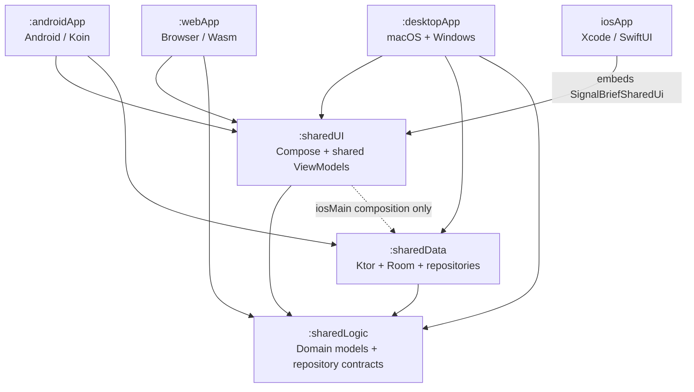

# SignalBrief — Architecture

This document describes the architecture that exists in the repository today. SignalBrief is a Kotlin Multiplatform news reader with Android, iOS, browser/Wasm, and Desktop hosts. It shares framework-free domain contracts and common presentation/UI while keeping platform persistence, networking, and lifecycle responsibilities explicit.

## Design principle

The project does **not** optimize for the highest possible shared-code percentage.

Code is shared when duplication would create maintenance risk or inconsistent behavior. Platform-specific responsibilities stay explicit when the runtime, security model, lifecycle, persistence, or deployment boundary is materially different.

That gives SignalBrief three useful layers:

1. **`:sharedLogic`** — web-safe, framework-free domain contracts and models.
2. **`:sharedUI`** — shared ViewModels and Compose Multiplatform UI.
3. Platform hosts and their platform/data implementations:
   - **`:sharedData` + `:androidApp` / `iosApp` / `:desktopApp`** for the Android, iOS, and macOS/Windows offline-first path.
   - **`:webApp`** for the public browser path.

## Module overview

```text
Shared modules
Unit / module       Targets / runtime                   Responsibility
------------------  ----------------------------------  -----------------------------------------------
:sharedLogic        Android, iOS, JVM Desktop, Wasm     Pure domain models, repository contracts,
                                                        typed failures, web-safe behavior.

:sharedData         Android, iOS, JVM Desktop          Shared data implementations: Ktor
                                                        networking, kotlinx.serialization, Room KMP
                                                        cache, and offline-first repositories.

:sharedUI           Android, iOS, JVM Desktop, Wasm     Compose Multiplatform UI, shared ViewModels,
                                                        navigation/screen shell, design system.

Application hosts
Unit / host         Targets / runtime                   Responsibility
------------------  ----------------------------------  -----------------------------------------------
:androidApp         Android application                 Process-level Koin composition boundary,
                                                        Android persistence/theme integration.

:desktopApp         macOS, Windows                      Compose Desktop host with isolated Koin,
                                                        runtime config, Room path, and resource lifecycle.

iosApp              SwiftUI/Xcode                       Xcode host, not a Gradle module. Embeds only
                                                        SignalBriefSharedUi; isolated Koin composition
                                                        remains behind its Swift-facing Kotlin boundary.

:webApp             Browser/Wasm                        Browser executable, WebNewsRepository,
                                                        browser-local WebSavedArticlesRepository,
                                                        browser-local WebCollectionsRepository,
                                                        browser-local WebTopicMonitoringRepository.
```

## Dependency direction


```mermaid
flowchart TB
    androidApp[":androidApp<br/>Android / Koin"]
    desktopApp[":desktopApp<br/>macOS + Windows"]
    iosApp["iosApp<br/>Xcode / SwiftUI"]
    webApp[":webApp<br/>Browser / Wasm"]
    sharedUI[":sharedUI<br/>Compose + shared ViewModels"]
    sharedData[":sharedData<br/>Ktor + Room + repositories"]
    sharedLogic[":sharedLogic<br/>Domain models + repository contracts"]

    androidApp --> sharedUI
    androidApp --> sharedData
    desktopApp --> sharedUI
    desktopApp --> sharedData
    desktopApp --> sharedLogic
    iosApp -->|"embeds SignalBriefSharedUi"| sharedUI
    webApp --> sharedUI
    webApp --> sharedLogic
    sharedUI --> sharedLogic
    sharedData --> sharedLogic
    sharedUI -. "iosMain composition only" .-> sharedData
```

Arrows show dependency or use direction. `:webApp` intentionally does **not** depend on `:sharedData`.

The dashed relation represents the iOS-specific composition source set in `:sharedUI`, which may depend on `:sharedData` to preserve the current single-framework Xcode integration; it is not a `commonMain` dependency. `:sharedLogic` and `:sharedData` retain iOS targets but do not emit standalone framework binaries; the iOS host consumes only `SignalBriefSharedUi`. Common UI/ViewModel code still depends on `:sharedLogic`, not on concrete data implementations.

## `:sharedLogic`

`:sharedLogic` contains the portable domain boundary:

- `Article`, `Source`, `TopHeadlinesFeed`, `FeedSource`, `Collection`, and `MonitoredTopic`.
- `NewsRepository`, `SavedArticlesRepository`, `CollectionsRepository`, and `TopicMonitoringRepository` contracts.
- `NewsFailure`, `CollectionFailure`, and `TopicMonitoringFailure` typed failures.
- Business logic that does not require Room, Ktor, Compose, Coil, UIKit, Android, or browser APIs.

This module is the architectural seam that allows both the Android/iOS/Desktop offline-first repository and the browser repository to satisfy the same UI-facing contracts.

It has no Koin dependency, annotations, compiler plugin, `KoinComponent`, or service-locator lookup. Dependencies enter shared business code only through constructors and repository contracts.

## `:sharedData` — shared data layer

`:sharedData` depends on `:sharedLogic` and contains the data/network/storage implementations for Android, iOS, and Desktop. Its JVM Desktop target provides CIO networking and a `BundledSQLiteDriver`-backed Room database for `DesktopComposition`.

### Remote

- Ktor 3 client.
- kotlinx.serialization DTOs and mapping.
- Android, Darwin, and CIO (JVM Desktop) engines.
- response validation and timeout configuration.
- NewsAPI request configuration.

### Local

- Room KMP database.
- country-scoped cached headline entities/DAO.
- transactional feed replacement.
- persistent Saved Articles storage for Android, iOS, and Desktop.
- Room-backed collections and collection memberships.
- Room-backed monitored topics.
- Platform database factories: Android and iOS resolve their own store location; the Desktop factory receives an explicit path from `:desktopApp` and uses `BundledSQLiteDriver`.

### Repository

`OfflineFirstNewsRepository` implements `NewsRepository` with an explicit network-first/cache-fallback policy.

```text
request
  -> remote NewsAPI

success
  -> validate/map/deduplicate
  -> transactionally replace country cache
  -> FeedSource.NETWORK

NewsFailure.Network
  -> read Room cache
  -> if non-empty: FeedSource.CACHE
  -> otherwise preserve original network failure

InvalidData / Unknown
  -> do not hide with cached content
```

Cancellation is rethrown rather than converted into a domain failure.

`OfflineFirstNewsRepository.clearCachedTopHeadlines(country)` deletes only the requested country's cached headlines in one transaction, performs no network request, and leaves observable cache state emitting an empty list afterward.

## `:sharedUI` — presentation and Compose UI

`:sharedUI` contains the application presentation surface shared across targets:

- app shell and main destinations;
- Top Headlines ViewModel/screen;
- Search ViewModel/screen;
- Saved Articles;
- Article Details;
- Daily Brief;
- Collections;
- Topic Monitoring;
- Settings and Offline Management;
- mobile onboarding;
- theme and design tokens;
- article cards and shared actions;
- platform image-loading boundary.

ViewModels depend on repository contracts from `:sharedLogic`, not on concrete data implementations.

The UI uses `StateFlow` and explicit callbacks. Repository state is observed by multiple features so Headlines, Search, Saved, Details, Daily Brief, Collections, Topic Monitoring, and Settings stay consistent without each screen owning a separate network implementation.

`SettingsViewModel` observes `NewsRepository.observeCachedTopHeadlines()` reactively to derive the downloaded-headline count and calls `clearCachedTopHeadlines(country)` for explicit local-only cache clearing, which never triggers a network request.

## Android composition

Android's process-level composition boundary is Koin 4.2.2. `SignalBriefApplication` starts it once with the Android data and ViewModel modules; `MainActivity` owns Android host concerns but does not hold repositories.

```text
SignalBriefApplication
  -> startKoin(android data module, ViewModel module)
      -> BuildConfig.NEWS_API_KEY -> NewsApiConfig -> Ktor Android HttpClient
      -> Room database -> local data source
      -> remote + local -> OfflineFirstNewsRepository
      -> repository contracts and Android preferences
MainActivity / root Compose
  -> Koin ViewModels
  -> existing Activity ViewModelStoreOwner and ScreenViewModelScope route owners
  -> shared UI
```

Screen ViewModels retain their existing `ViewModelStoreOwner`/`ScreenViewModelScope` lifetimes; Koin supplies constructor dependencies and is not a service locator in shared business code. Android additionally owns DataStore-backed theme/onboarding preferences and Android-specific host behavior.

## iOS composition

The iOS host is SwiftUI embedding the `SignalBriefSharedUi` shared Compose framework. It is an Xcode host, not a Gradle module.

The Swift-facing `createIosComposeHost` boundary remains unchanged. Its root creates an isolated `koinApplication`, then `IosComposition` resolves the Darwin Ktor client, Room database, and repository contracts. The NewsAPI key is injected through the git-ignored Xcode configuration and read from the app bundle.

`IosComposition` explicitly owns the client/database resources and has idempotent disposal when the Compose host is torn down. It does not use global `startKoin`; Koin constructs the graph inside the isolated boundary while the host preserves explicit lifecycle ownership.

## Desktop composition

`:desktopApp` is a macOS and Windows Compose Desktop host. `Main.kt` reads the runtime `NEWS_API_KEY`, resolves the database path, and creates one isolated `koinApplication` through `DesktopComposition` before entering `application {}`. It does not use global `startKoin`.

```text
Desktop Main
  -> NEWS_API_KEY + Desktop database path
  -> isolated koinApplication + DesktopComposition
      -> CIO HttpClient -> KtorNewsRemoteDataSource
      -> Room KMP database -> RoomNewsLocalDataSource
      -> OfflineFirstNewsRepository
      -> RoomSavedArticlesRepository
      -> RoomCollectionsRepository
      -> RoomTopicMonitoringRepository
  -> SignalBriefAppHost
```

The host owns the composition for the full application lifetime and calls idempotent `dispose()` after `application {}` returns. Disposal closes the CIO `HttpClient`, `SignalBriefDatabase`, and isolated Koin application; repository classes never own those resources. If construction fails after the client is created, the composition factory closes any already-created resource before propagating the failure.

The database path is `~/Library/Application Support/SignalBrief` on macOS and `%APPDATA%/SignalBrief` on Windows. Desktop uses Coil 3's Ktor network fetcher for remote article images. Linux is intentionally unsupported.

## Browser/Wasm composition

`webApp` is a browser executable and depends on `:sharedLogic` and `:sharedUI`.

```text
ComposeViewport
  -> remember WebNewsRepository
  -> remember WebSavedArticlesRepository
  -> remember WebCollectionsRepository
  -> remember WebTopicMonitoringRepository
  -> SignalBriefAppHost
  -> ScreenViewModelScope -> manual ViewModel constructors
```

The Web host skips mobile onboarding. Manual constructor composition is intentional here, not an incomplete Koin migration: the four browser repositories are remembered for the root Compose lifetime and passed through the reusable contract-only host. Each route uses the shared `ScreenViewModelScope`, which clears its ViewModel store on disposal; screen ViewModels are created with manual Compose factories.

Web has no Koin dependency and no `:sharedData`/Room/Ktor-client graph. It uses browser `fetch` at the Cloudflare Pages boundary and localStorage for browser persistence, so there is no process-like container lifecycle or explicit client/database resource to own.

### `WebNewsRepository`

`WebNewsRepository` satisfies the same `NewsRepository` contract as the Android/iOS/Desktop offline-first implementation.

It:

- requests `/api/headlines?country=...` with browser `fetch`;
- maps the normalized Pages Function response into domain `Article` objects;
- keeps a single current in-memory headline set in a `MutableStateFlow` (no independent per-country Web caches);
- exposes that flow through `observeCachedTopHeadlines(country)` so Search, Daily Brief, and Settings see the same article set;
- clears the current in-memory set locally through `clearCachedTopHeadlines(country)` without performing a network request;
- maps transport/data failures into the shared `NewsFailure` hierarchy.

The browser client does not contain the NewsData API key.

### `WebSavedArticlesRepository`

Web Saved Articles persist in the browser through the `signalbrief.savedArticles.v1` localStorage key. State is loaded once at construction and updated after every successful write, so Saved Articles survive Web application reloads within the same browser.

This is intentionally parallel to the persistent Android/iOS/Desktop implementation.

### `WebCollectionsRepository`

`WebCollectionsRepository` persists collections and their article memberships in browser localStorage under the `signalbrief.collections.v1` and `signalbrief.collection-memberships.v1` keys.

Collections and memberships are restored at construction and observable state only changes after a successful storage write. Membership snapshots are independent of saved articles, so an article stays displayable in a collection after it is unsaved.

### `WebTopicMonitoringRepository`

`WebTopicMonitoringRepository` persists monitored topic queries in browser localStorage under the `signalbrief.topic-monitors.v1` key.

The queries are restored at construction; observable state only changes after a successful storage write. Matching against local headlines is done by shared presentation logic, so the Web topic-monitoring flow uses the same repository contract and matching semantics as the Android/iOS/Desktop flow.

## Cloudflare Pages Functions

The public Web deployment has two server-side endpoints.

### `/api/headlines`

```text
browser
  -> /api/headlines?country=us
  -> Cloudflare Pages Function
  -> NewsData.io
```

Responsibilities:

- keep `NEWSDATA_API_KEY` server-side;
- request the English top-headlines feed;
- normalize provider fields into the small payload required by SignalBrief;
- normalize source names;
- generate signed image-proxy references;
- edge-cache responses to reduce upstream requests.

### `/api/image`

Article images come from many unrelated publisher/CDN origins. Fetching them directly from browser Wasm would make rendering depend on every publisher's CORS policy.

The image endpoint therefore provides a same-origin boundary:

```text
normalized headline image URL
  -> HMAC-signed /api/image reference
  -> validate signature
  -> accept HTTPS only
  -> reject obvious local/private targets
  -> fetch publisher/CDN image
  -> validate image content type and size
  -> cache at the edge
  -> return same-origin bytes to the browser
```

`IMAGE_PROXY_SIGNING_KEY` is a Cloudflare secret and is not stored in the repository.

The browser converts the response from `ArrayBuffer` to `ByteArray`, decodes it to `ImageBitmap`, and renders it through the shared article-image component.

## Image-loading boundary

The shared UI does not force one image stack onto every runtime.

- **Android/iOS/Desktop**: Coil 3 with the Ktor network setup.
- **Web/Wasm**: signed same-origin proxy + browser `fetch` + `ImageBitmap`.

`Article Details` and list cards reuse the same platform image boundary, avoiding a separate Web-only Details implementation.

## External article opening

`Article.url` is validated before it is opened. Only `http://` and `https://` destinations are actionable.

The shared UI delegates valid URLs to the platform URI handler:

- Android host / Chrome Custom Tabs where applicable.
- iOS / browser through the platform URI handler.

## Secret handling

### Mobile local development

Android:

```text
local.properties
NEWS_API_KEY=...
```

iOS:

```text
iosApp/Configuration/Secrets.xcconfig
NEWS_API_KEY=...
```

Both files are ignored and must never be committed.

These keys are still client-side at runtime and are therefore explicitly a local-development configuration, not a production mobile credential design.

### Desktop local development

Desktop reads `NEWS_API_KEY` from the process environment before creating its isolated Koin `DesktopComposition`. The key is never written to a tracked configuration file or logged. This runtime supports macOS and Windows only.

### Public Web

Cloudflare production secrets:

- `NEWSDATA_API_KEY`
- `IMAGE_PROXY_SIGNING_KEY`

Neither value is embedded in JavaScript/Wasm or committed to Git.

## Test boundaries

### `:sharedLogic`

Pure repository-contract/model/failure tests.

### `:sharedData`

- Ktor remote/data mapping tests.
- Room-backed local tests.
- offline-first repository policy tests.
- cancellation and failure classification.

### `:sharedUI`

- ViewModel tests for Headlines, Search, Saved, Details, Daily Brief, Collections, Topic Monitoring, and Settings;
- shared UI/component behavior;
- Android/iOS/Wasm compilation of the shared UI boundary.

### `:webApp`

- `WebNewsRepository` behavior through an injected loader;
- localStorage-backed Saved, Collections, and Topic Monitoring repository behavior (including mutation and failure paths);
- Wasm tests and production browser distribution.

## CI

Five pull-request checks protect `main`.

### Android CI

- Gradle wrapper validation
- `ktlintCheck`
- `detekt`
- JVM tests
- Android lint
- debug assembly
- Kover verification

### KMP and iOS CI

- shared tests
- iOS framework linking
- formatting/static analysis
- unsigned iOS simulator host build

### Desktop CI

- Desktop compilation of `:sharedLogic`, `:sharedData`, `:sharedUI`, and `:desktopApp`
- Desktop execution of the `:sharedLogic`, `:sharedData`, and `:sharedUI` test suites
- `:desktopApp` jar assembly
- separate macOS and Windows runners

### Web CI

- supported JDK/Node environment
- Binaryen toolchain
- Wasm tests/build validation
- production browser distribution

### Dependency Review

Fails pull requests introducing moderate-or-higher vulnerable dependencies.

The Web dependency lock deliberately remains free of the Ktor/Coil network dependencies that previously pulled `ws` into the Wasm dependency graph.

## Trade-offs and current limitations

- Android/iOS/Desktop offline-first networking/storage and browser networking are separate implementations behind shared contracts.
- Desktop has no installers, signing/notarization, or final package identifiers.
- Desktop intentionally has no Linux target.
- Desktop onboarding state is not persisted, and Windows GUI runtime smoke testing must occur on Windows.
- The Web host persists Saved Articles, Collections, and Monitored Topics in browser localStorage, but there is no cross-device synchronization.
- Search operates over locally available headlines rather than a dedicated backend index.
- The public Web feed currently uses an English/US top-headlines configuration.
- Android and iOS use a developer-supplied NewsAPI key for local development and are not store-published from this repository.
- No account system, cloud Saved synchronization, payments, or analytics backend is included in the public portfolio scope.
- The Web Wasm bundle is larger than a conventional DOM application because it includes the Compose/Skia runtime; current CI reports this as a performance warning rather than a build failure.

## Why this architecture

SignalBrief started as an Android application and evolved into a KMP project. The current structure demonstrates that evolution without pretending every runtime has identical constraints.

The reusable part is the stable product behavior:

- domain models/contracts;
- ViewModel behavior;
- navigation/screen flow;
- design system and Compose UI.

The replaceable part is infrastructure:

- Android/iOS/Desktop networking and persistence;
- browser fetch/backend boundary;
- platform image loading;
- host lifecycle and dependency composition.

That separation is the central architectural goal of the project.
